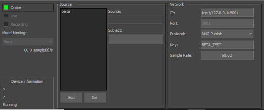
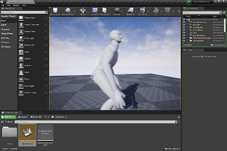

=========
Downloads
=========

Releases
--------

The latest releases can be found on github:
* `Builds <https://github.com/mocap-ca/Open3DStream/releases/latest>`_

MotionBuilder
-------------

The motion builder plugin can be used to send motion capture data to 
maya or unreal.  Motion Builder 2014-2022 builds available.

Maya
----

The Maya plugin can be used to receive live data from the motion builder plugin.
Maya 2014-2022 builds are available.

Unreal
------

The unreal plugin can recive motion capture data from the motion builder
plugin and make it available as a live link source.  The plugin is provided
as source code and should work with all recent versions of Unreal.

Test FBX Model
--------------

* `Beta Skinned <https://github.com/mocap-ca/Open3DStream/raw/master/test_data/beta_skinned.fbx>`_
